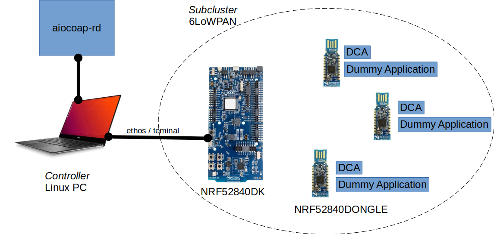

# Test Application for Integrating NRF52 Dongles into a Doriot Subcluster

This test application demonstrates how a node can be integrated into a Doriot (sub-)cluster.

It does the following:

- The subcluster is a 6LoWPAN network, whrere nods can join freely.
- The nodes can run the application stub in this repo, which registers them to a resource directory.
- The DCA-interface of the node can then be queried
- Nodes, once flashed, do not need a terminal connection to operate.
- The "application" in `main.c` is a dummy and can be extended. Currently, it just opens a shell.

## Prerequisites

- aiocoap-rd, see the [turorial in our Wiki](https://code.ovgu.de/doriot/prototype/-/wikis/hardware/aiocoap)
- RIOT 2021.10-devel, as of 24.9.2021 or later (supports coap RD interaction)
- The [`gnrc-border-router`](https://github.com/RIOT-OS/RIOT/tree/master/examples/gnrc_border_router) RIOT example should be running on your machine; see the readme there
- [Doriot-DCA](https://code.ovgu.de/doriot/wp5/doriot_dca) cloned and configured with `EXTENAL_MODULE_DIRS`

## Hardware Setup

As an example setup, let use assume `nrf52840dk` board as border router for 6LoWPAN.
The local machine (necessarily linux PC) hosts the coap resource directory, which is provided by `aiocoap`.
A set of `nrf52840dongle`-nodes can join via 6LoWPAN.

# Running

To set up the example shown above, execute the following steps.

Start the `gnrc-border-router` example (assuming the border router board is available under `/dev/ttyACM0`).

    cd your/RIOT/examples/path...
    make flash BOARD=nrf52840dk PORT=/dev/ttyACM0
    make term BOARD=nrf52840dk PORT=/dev/ttyACM0

The root password is required since a virtual network interface is set up with the term command.

Then, run aiocoap-rd

    cd your/aiocoap/path...
    ./aiocoap-rd

Finally, flash the dongle with the application stub in this repository.
It does nothing but initializing DCA and then registering at the RD.

    cd your/path/to/this/repo...
    make flash BOARD=nrf52840dongle PORT=/dev/ttyACM1

## Querying the RD

To query the RD, use `coap-client`.
An endpoint-lookup shows all connected nodes.

    coap-client -m get coap://localhost/endpoint-lookup/
      Response: </reg/1/>;ep="RIOT-BBCC46C455F88F8B";base="coap://[2001:db8::b8cc:46c4:55f8:878b]";rt="core.rd-ep"

A resource-lookup shows all resources.

    coap-client -m get coap://localhost/resource-lookup/
      Response: <coap://[2001:db8::b8cc:46c4:55f8:878b]/dca>;ct="0";rt="dca"

You can now query the DCA database of a node.

    coap-client -m get coap://[2001:db8::b8cc:46c4:55f8:878b]/dca/board/ram
      Response: 32768

## Troubleshooting

Setting up everything is quite tedious.
Make sure to go through all of the examples mentioned in the prerequisites first.
Some caveats might be gathered here in future to ease the setup.
